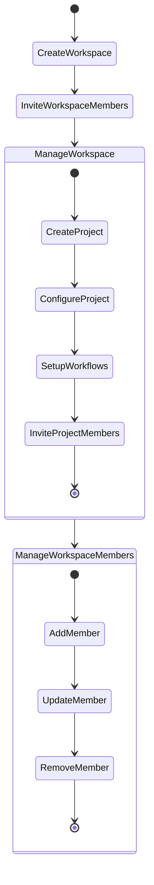
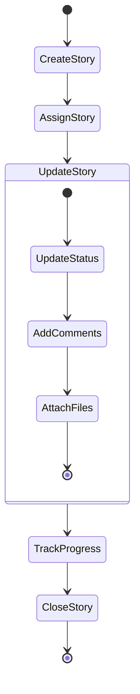
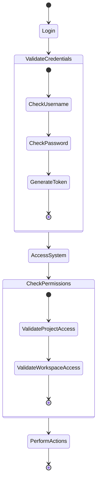
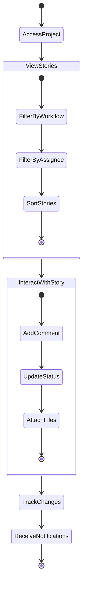

# Taiga Activity Diagrams

This document presents the main activity flows in the Taiga system.

## 1. Workspace and Project Management Flow

## 2. Story Management Flow

## 3. User Authentication Flow

## 4. Project Collaboration Flow

## Activity Flow Descriptions

1. **Workspace and Project Management**
   - Users create workspaces as organizational units
   - Within workspaces, users can create and configure projects
   - Project setup includes workflow configuration and team member invitations
   - Workspace members can be managed (added, updated, removed)

2. **Story Management**
   - Stories represent work items in projects
   - Stories go through a lifecycle of creation, assignment, and updates
   - Updates include status changes, comments, and file attachments
   - Progress is tracked until story completion

3. **User Authentication**
   - Users authenticate through login
   - Credentials are validated and tokens generated
   - System access is controlled through permissions
   - Actions are authorized based on user roles

4. **Project Collaboration**
   - Team members access projects and view stories
   - Stories can be filtered and sorted
   - Members interact through comments and status updates
   - Changes trigger notifications to relevant team members

## Key Features in Workflows

1. **Permission Management**
   - Workspace and project access is controlled
   - Different roles have different permissions
   - Public and private access settings

2. **Notification System**
   - Users receive notifications for relevant changes
   - Notifications for mentions, assignments, and updates
   - Email notifications for important events

3. **File Management**
   - Support for attachments and media files
   - File organization by project and story
   - Secure file storage and access

4. **Version Control**
   - Story updates are versioned
   - Change tracking for accountability
   - Conflict prevention through optimistic locking