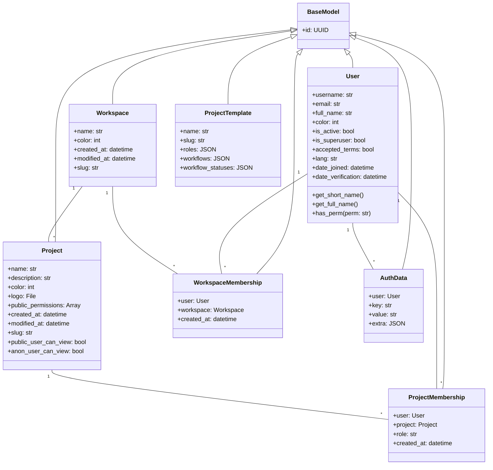

# Taiga Class Diagram

This document presents the class diagram showing the core entities and their relationships in the Taiga system.

## Key Relationships

1. **User - Workspace**
   - Users can be members of multiple workspaces through WorkspaceMembership
   - Each workspace can have multiple users as members

2. **Workspace - Project**
   - A workspace can contain multiple projects
   - Each project belongs to exactly one workspace

3. **User - Project**
   - Users can be members of multiple projects through ProjectMembership
   - Each project can have multiple users as members
   - Project membership includes role information

4. **User - AuthData**
   - Users can have multiple authentication data entries
   - Each auth data entry belongs to exactly one user

5. **Project - ProjectTemplate**
   - Projects can be created from templates
   - Templates define roles, workflows, and statuses

## Inheritance

All main entities inherit from BaseModel, which provides:
- UUID primary key
- Common database functionality
- Basic model operations

## Additional Features

1. **Timestamps**
   - Workspace and Project include creation and modification timestamps
   - Memberships track creation time

2. **Slugs**
   - Workspace, Project, and ProjectTemplate maintain slugified versions of their names
   - Used for URLs and unique identification

3. **Permissions**
   - Projects maintain public permission settings
   - Users have superuser status and permission checks
   - Project memberships include role-based permissions

4. **Metadata**
   - Projects store logos and colors
   - Users maintain language preferences and verification status
   - Templates store workflow configurations as JSON