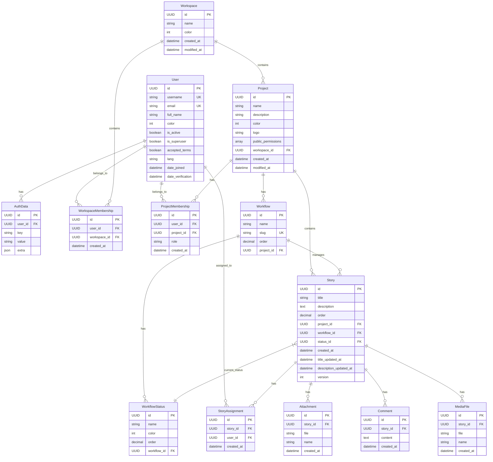

# Taiga ER Diagram

This document presents the Entity-Relationship diagram showing the database structure and relationships in the Taiga system.

## Key Relationships

1. **User Relationships**
   - Users can belong to multiple workspaces through WorkspaceMembership
   - Users can belong to multiple projects through ProjectMembership
   - Users can be assigned to multiple stories through StoryAssignment
   - Users can have multiple authentication data entries

2. **Workspace Relationships**
   - Workspaces contain multiple projects
   - Workspaces have multiple members through WorkspaceMembership

3. **Project Relationships**
   - Projects belong to one workspace
   - Projects have multiple workflows
   - Projects contain multiple stories
   - Projects have multiple members through ProjectMembership

4. **Story Relationships**
   - Stories belong to one project
   - Stories are managed by one workflow
   - Stories have one current status
   - Stories can have multiple assignees
   - Stories can have multiple attachments, comments, and media files

5. **Workflow Relationships**
   - Workflows belong to one project
   - Workflows contain multiple statuses
   - Workflows manage multiple stories

## Important Notes

1. **Primary Keys**
   - All entities use UUID as their primary key

2. **Unique Constraints**
   - Username and email are unique for Users
   - Workflow slugs are unique within a project
   - WorkflowStatus IDs are unique within a workflow

3. **Timestamps**
   - Most entities track creation time
   - Some entities also track modification time
   - Stories track separate update times for title and description

4. **Versioning**
   - Stories implement versioning for optimistic concurrency control

5. **File Storage**
   - Projects can have logos
   - Stories can have attachments and media files
   - Files are stored with obfuscated paths

6. **Ordering**
   - Workflows, WorkflowStatuses, and Stories maintain order fields
   - Most entities have default ordering by name or creation time