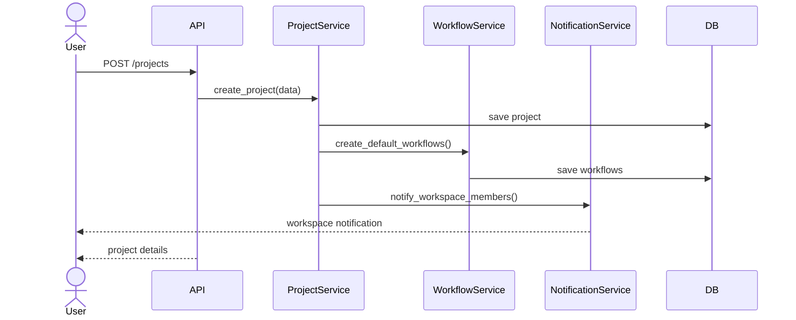
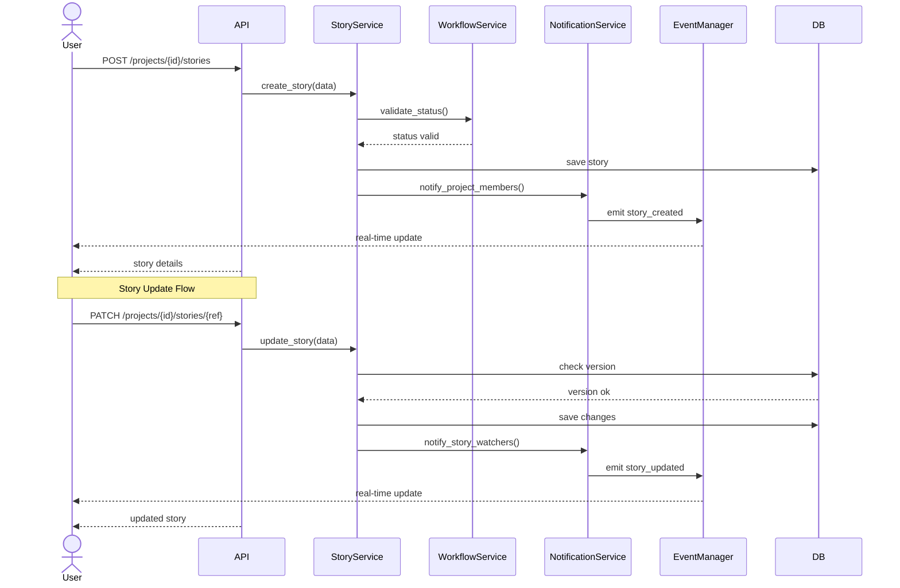
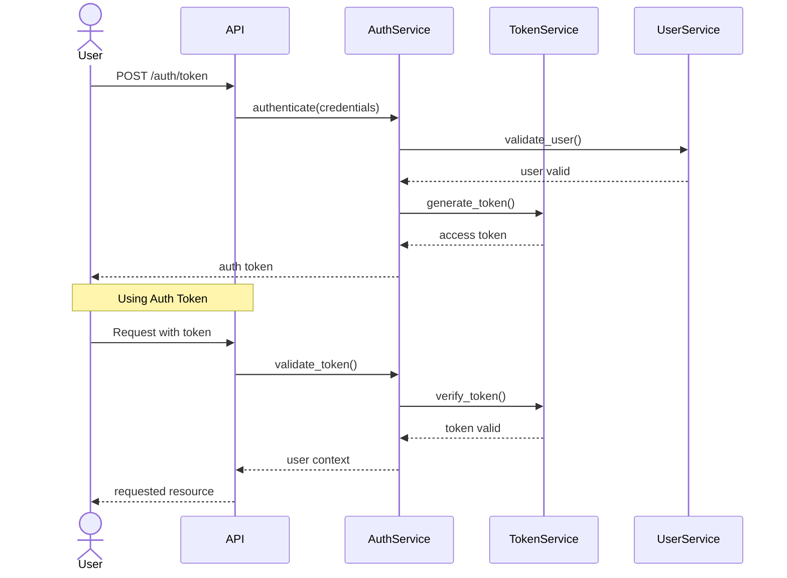
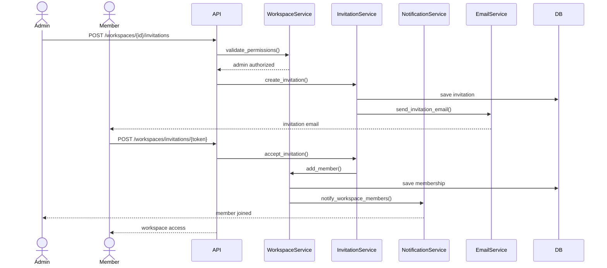

# Taiga Sequence Diagrams

This document presents the key interaction sequences between different components in the Taiga system.

## 1. Project Creation Sequence

## 2. Story Management Sequence

## 3. Authentication Flow

## 4. Workspace Collaboration Sequence

## Key Interaction Patterns

1. **Authentication & Authorization**
   - Token-based authentication
   - Permission validation before actions
   - Role-based access control

2. **Real-time Updates**
   - Event-driven notifications
   - WebSocket connections for live updates
   - Email notifications for important events

3. **Data Consistency**
   - Version checking for updates
   - Transaction management
   - Optimistic concurrency control

4. **Service Communication**
   - Service-to-service interactions
   - Event propagation
   - Asynchronous notifications

## Important Notes

1. **Error Handling**
   - All interactions include error handling
   - Proper error responses to clients
   - Rollback mechanisms for failed operations

2. **Performance Considerations**
   - Asynchronous operations where possible
   - Efficient database queries
   - Caching of frequently accessed data

3. **Security Measures**
   - Token validation on every request
   - Permission checks at service level
   - Secure communication channels